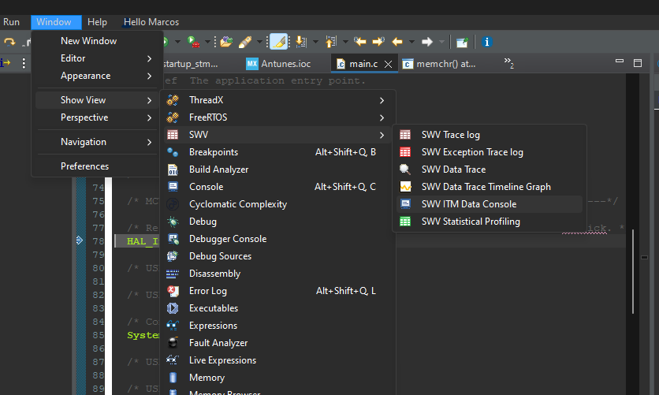
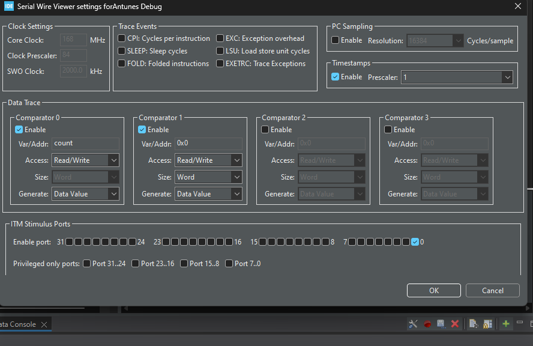

# GENERAL PORPUSE CODE SOURCE

## TIPS
To use printf();
```c
   #include <stdio.h> //and press red button on bottom right corner
```
_write function also must be redefined before main()
```c
int _write(int file, char* ptr, int len){
	int i = 0;
	for(i=0; i < len; i++)
		ITM_SendChar((*ptr++));
	return len;
}
```


 

 